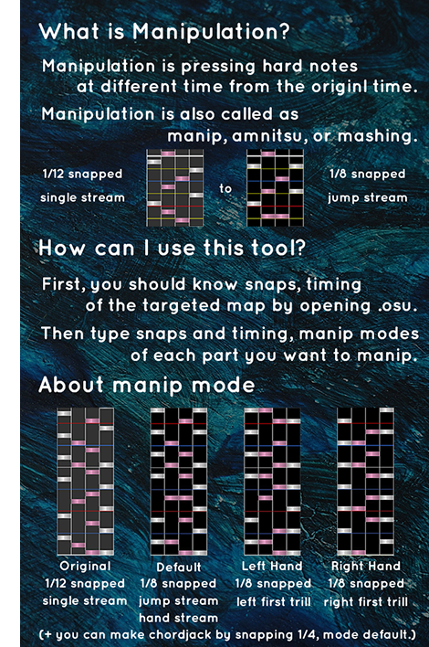

# Osu-mania-Manipulation-Generator
## DOWNLOAD PROGRAM :
 Github : https://github.com/adgjl7777777/Osu-mania-Manipulation-Generator/releases/tag/v1.0
 Dropbox : https://www.dropbox.com/s/qnifq91iaa4z2cl/Osu%21%20mania%20Manipulation%20Generator%20by%20Transcendence.zip?dl=0
 Mega : https://mega.nz/#!RB0gkagZ!9p-4xA-tpCpD9P6gt6Wk7BMLI_zCo7VuG1ysIvvVSgI
## The compact explanation about this program

## Important things you should know
0. This program is the tool for users to make hard maps to manipulatable easy maps.
 You can convert .osu files.  
1. This program works in Windws 10. However, I couldn't test it in other OS.
 Therefore, this program might not work in other OS.  
2. If there is some errors, please check your .osu files.
 (1) The .osu file might have invalid contents.
 (2) The .osu file might have no bpm information.
 (3) You might typed invalid time.
 (4) You might typed overlapped time. For example, Part 1 time : 0ms ~ 40000ms, and Part 2 time : 30000ms ~ 45000ms  
3. After generating, please check the map in Osu! editer with Ctrl+Shift+A to find whether notes are too close.  
4. If you have a question, please contact me. 
Discord : Transcendence#2000 
Twitter : @transcendtoinf 
Bilibili(it is not my major platfom so I can't respond your question frequently ;3;) : https://space.bilibili.com/470091030
  Thank you for visiting this site XD
